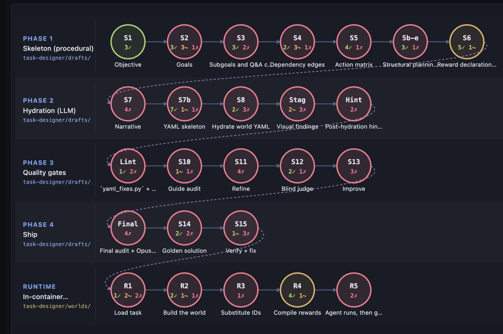

# world-builder-audit

Standalone audit toolkit for procedural world-builder gyms.

Walks a target gym repo against the canonical **lifecycle rubric** (141 checks across 5 phases / 25 stages), runs a battery of **deterministic Python scripts** where possible, and produces a scored Markdown report plus an interactive viewer.



> Pipeline view of an audit session — each circle is one of the 25 lifecycle stages (`S1` … `R5`). Border color summarizes the stage (green = all checks pass, yellow = mixed, red = at least one failing check). Inline counts (`3✓ 1~ 2✗`) show the per-stage pass / mixed / fail breakdown at a glance. Click any node to drill into its individual checks + evidence.

## Quick start

```bash
# 1. Install
uv sync   # or: pip install -e .

# 2. Run (prompts for the gym to audit)
./audit.py

#    Which gym to audit? (local path OR git URL)
#    > /path/to/some-gym

# 3. Menu:
#    1) Run deterministic scripts (no LLM)
#    2) Launch the viewer
#    3) Both
```

Direct invocations:

```bash
./audit.py scripts        # just run deterministic checks
./audit.py viewer         # launch viewer at http://127.0.0.1:8765
./audit.py both           # full flow
```

The selected target is recorded in `.last_target` so subsequent runs can reuse it (just hit Enter at the prompt).

## What's inside

| File / dir | Purpose |
|---|---|
| `lifecycle_rubric.yaml` | The canonical rubric — 141 checks, codes (`S1C1` … `R5C6`), why/suggestion/na_reason per check |
| `rubric.yaml` | Older category-based rubric, kept for legacy sessions |
| `CHECKS.md` | Per-rule manifest for the linter-rule checks |
| `world_generation_lifecycle.md` | Canonical reference doc describing each lifecycle stage |
| `scripts/` | Deterministic check runners (`s01_objective.py`, `s04_edges.py`, …) |
| `scripts/run_all.py` | Orchestrator — runs every `CHECKS = [...]` registry and merges into a session |
| `viewer/` | FastAPI server + single-page DAG view |
| `sessions/` | Audit results land here, one folder per session |
| `audit.py` | CLI entry point |
| `.claude/skills/gym-audit/` | Claude Code skill for agent-driven audit (LLM eval for the non-scripted checks) |

## How the audit works

Two complementary passes:

1. **Deterministic scripts** (`scripts/run_all.py`) — currently 44 of 141 checks (31%). Pure file inspection, parsing, counting, cycle detection, closed-set membership, reference resolution. Reproducible byte-for-byte from the target gym's filesystem alone — no LLM, no agent, no API.
2. **LLM evaluation** (via the `gym-audit` Claude Code skill) — covers the remaining checks that genuinely need semantic judgment (narrative quality, domain vocabulary, semantic distractor coherence, etc.).

The skill runs the scripts FIRST, then dispatches LLM agents only for the un-scripted checks. Wherever a script result exists, it is the source of truth.

## Adding a new deterministic check

1. Find the check in `lifecycle_rubric.yaml`.
2. Add a runner function to the appropriate `scripts/sXX_*.py` (or create a new one named after the stage).
3. Register it in the file's `CHECKS = [...]` registry.
4. Add `script: scripts/<file>.py::<fn>` to the check in `lifecycle_rubric.yaml`.
5. Run `./audit.py scripts` against your target gym to verify.

See `scripts/README.md` for the helper API (`bucket_to_result`, `gym_wide_result`, `list_drafts`, `load_stage`, etc.).

## Repo conventions

- Audit results NEVER touch the target gym. Sessions live under `sessions/` in THIS repo.
- The rubric is authored to be **gym-agnostic**: it speaks in terms of phases/stages and corpus paths (`task-designer/drafts/`, `task-designer/worlds/`). Per-gym overrides go in a future `gym_overrides/` folder.

## License

Proprietary — © Patronus AI.
